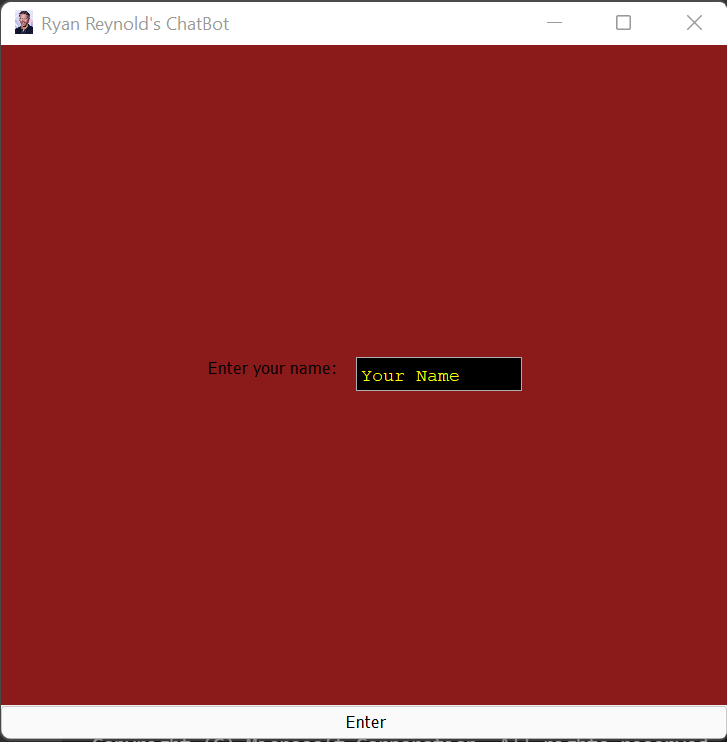
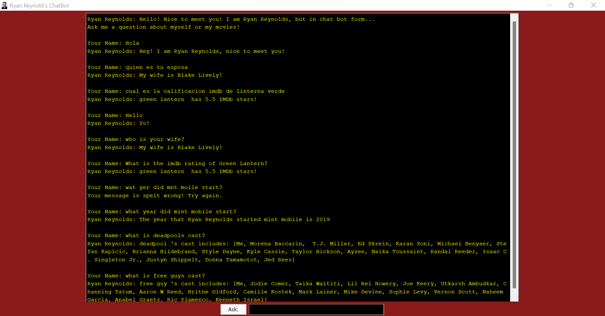

<h1 align="center"> Ryan Reynolds Chat Bot </h1>
<h2 align="center"> COSC 310 - Group 10</h2>
<h3 align="center">Lance Rogan, Blake Ablitt, Ben Van Bergeyk,  Griffin Wilchuk, and Carla Mather </h3>

  
 
<a href="https://www.imdb.com/name/nm0005351/">Learn more about Ryan Reynolds</a>
 <h2>About the Project:</h2>
 
This project is a chatbot which takes user inputs and responds as though it is the famous actor Ryan Reynolds. It can handle a wide variety of questions, languages such as spanish, and spelling errors about Ryan Reynolds’ personal life, movies acted in, or businesses. The program will boot up a pre GUI and main GUI and then be ready for the user to ask any question they like. If the chatbot version of Ryan Reynolds knows the answer via array lists and hash mapping then the user will see the response on screen, but if the chatbot version of Ryan Reynolds does not know the answer then the user will see a variety of messages explaining that the chatbot can’t answer their question. Occasionally, if the question is appropriate for a return question, the Ryan Reynolds chatbot will sometimes ask a question back to the user. This will be a response question. This back and forth between the user and the Ryan Reynolds chatbot will go on for an infinite amount of time before the user chooses to end the program with a simple trigger word "Goodbye".

  
 <h1>Demonstration</h1>
 

  <h2>Pre GUI Example</h2>
 
  
 <h2>Main GUI Example</h2>
 
  
 <h3>Class Organization:</h3>
 
The Class organization of this Chat-Robot is detailed. We have a Business.java class, Movie.java Class, and RyanReynolds.java class which specify the attributes, movies, and businesses that the actor Ryan Renyolds is associated with. Next we have the ChatBot.java class which is the main functionality of this chat bot and is the main class you want to run to run this program. Furthermore, we also have our Tokenizer.java, Translate.java, and POSTagging.java classes which are our 3 toolkit API classes. Lastly, we have our three test cases, checkPOSPRobTest.java, tokenizerTest.java, and wordForWordTest.java which is a unit test for each critical functionality method we implemented.

 <h3>1.) Ryan Reynolds Class:</h3>
 
This Ryan Reynolds class is essentially a class which encapsulates and acquires all of the physical attributes, personal / personal informational attributes, and Movie Attributes. For example, this class is essentially creating an object approximation of the actor Ryan Reynolds with all of his most imporant information. In this class we have his: height, weight, hair color, eye color, gender, birthplace, wifes name, kids names, social media handle, twitter followers, instagram followers, tiktok followers, net worth, previous marriage, personal / other awards.   In addition to this, we also have a sample of 12 movies Ryan Reynolds has been in which are also included in his attributes. The movies included are: Deadpool, Deadpool 2, Free Guy, R.I.P.D, Green Lantern, Buried, 6 Underground, Red Notice, Self/Less, The Hitman's Bodyguard, Change up, and the proposal. It is imporant to note that each movie object contains: IMDb star rating, title, year it was released, PG-13 or advisory rating, List of main cast members, Director, genre, list of all awards given to movie, box office profit, location movie was filmed, time taken to film the movie, duration/length of movie, and the budget of the movie. This class includes necessary and additional constructors, and all of the getters and setters provided.

 <h3>2.) Movie Class:</h3>
 
This movie class is essentially a class which creates a movie object which stores information about a movie, which is then initialized and used as various attributes in the Ryan Reynolds class. For example, each movie object contains: IMDb star rating, title, year it was released, PG-13 or advisory rating, List of main cast members, Director, genre, list of all awards given to movie, box office profit, location movie was filmed, time taken to film the movie, duration/length of movie, and the budget of the movie. This class also includes necessary and additional constructors, all of the getters and setters, and a customized toString() method which specifies movie information.

  <h3>3.) Business Class:</h3>
 
This Business class is essentially a class which creates a business object which stores information about a businesses, which is then initialized and used as various attributes in the Ryan Reynolds class. For example, each business object contains: the name of the business, the year the business was started/established, the location the business is in, and the title of Ryan Reynolds holds in the business. This class also includes necessary and additional constructors, and all of the getters and setters which specifies the business information.

 <h3>4.) ChatBot Class:</h3>
 
Here is a general overview of the UPDATED ChatBot main class:   First we have all of our imports for the various features like the spellcheck, GUI, local dates, action events and so on. This ChatBot class extends JFrame and implements the ActionListener method and begins by creating a Ryan Reynolds object with all of his personal attributes inputted. We then define various booleans, strings, ArrayLists, HashMaps, JFrames, JPanels, JScrollPanes, JButtons, ImageIcons, and others for various purposes. After defining all of these public static variables we have a preDisplay method (which is run from the main method) which creates a new JFrame display with specific formats, icons, panels and colours which allows the user to enter their name into a text field. After the user enters their name into this field and clicks the button, this then initiates the action performed method which then verifies the user entered a name, sets the pre GUI to not be visible, and then creates a new main GUI and calls the main GUI to be set up. This then goes to set up the main GUI with specified frames, panels, fonts, text area and fields, scroll panes, buttons, and image icons. After initializing this GUI it is then set up further with colours, backgrounds, and layout features.  After this pre setup we make it into the main functionality of the ChatBot class. Here we are checking in the action performed class if the action event is from the button, aka if the user clicked the button. If this is the case then we enter into the main section of our code. Here we check if the text field length is >1, aka if there is text, if there is then we continue, otherwise we do nothing. Next we check if the text is equal to ".clear", and if it is, then we clear all the messages and say everything is cleared. Otherwise, we proceed as normal into the main functionality.    After this we then initialize the greeting responses arraylist, movie question array list, personal question arraylist, and list of business questions array list. Then we also create a list of movies array list and list of businesses array list. From this point, we have various question arraylists containing the key words that will be in each question about a certain movie, business, peronsal life, or greeting. We then call the fillInAMovieMap method which initializes each corresponding map to each question.   The way it does this is for example, is we fill in the movie map for the movie question that contains "imdb", or the user asking about the IMDb rating of a movie. We then send into this method the imdb hash map, and the key value "imdb" which is a part of the array list movie questions. From this method, we iterate through each movie object, and we set the key to be the movie title, and the value to be the imdb score of that movie. Thus creating an imdb hash map which contains all the keys for every movie, and all the imdb values as the key=value pair for each movie. We repeat this similar and almost identical process for every question you can ask about movies, businesses, personal questions, greetings etc.  After all of the hash maps are initialized, we are ready to begin getting the user input. Here we grab the user input unformatted and display that the user is saying the input on the chat area or JTextArea, and then we format it to lowercase for processing.   We first process the user input by sending it to our first toolkit API to translate it from an expected lanugage of our choosing into english, so if it was spanish saying "hola" it would translate to "hello" in english. We then call our second toolkit API and tokenize the user input using the openNLP tokenize API. After this, we then use our third toolkit API and we get the POS tags and the POS tags probability for each word.  Next we check if the user input is goodybe, if so we end the program with a 3 second delay and say goodbye, otherwise we continue.   We call our main function chatbot function, which then checks if the probability of the POS tags is all greater than 0.6, AKA most spelling is correct, otherwise, we then call the wordForWord method which checks every user word with a large english dictionary txt file to ensure the spelling is correct. If either of these fail, the user is notified their spelling is incorrect. Otherwise we analyze the input futher by calling the analyzeInput function.  Analyze input basically checks if the user input contains a key string value from greeting responses, a movie title, a personal question title, or a business name. If it does, then it sets a string equal to what movie title, business name, or thing was being asked about, and it then checks the string again for which question in any of the arraylist questions for movies etc match. For example, we ask about Deadpools imdb, it reads deadpool so it knows its about a movie, then it checks again and sees that its asking about imdb, so then it goes to the imdb Map created earlier and grabs the key-value pair for deadpool and imdb, which is the string we then display on the text area / chat area for the user.  If all of these fail, then we display a default response to the user that the bot does not understand the message or question using a default response method. Lastly, if the bot is asked a personal question, the bot will ask "How about you?" and ask the user a question / the same question back 1/6 of the time.  This is a very high level overview of what happens in the ChatBot class and its main functionality. If there are any questions or you would like a more detailed and clear explanation, reach out to us and we would be happy to explain.
  

  
  
 <h3>5.)The Translate Class</h3>
 
 This class contains an API to WhatsMate Translator. There is a small sample program in the main, fromLang is used to specify the input langaue while toLang is used to specify the output language. The string text contains the string youd like to translate. For our purposes, the method translate() is called on every user input to ensure all text is in english before processing begins. All credit for this API goes to WhatsMate and their team, please see refrences file for more information.

 <h3>6.)The POSTagging Class</h3>
 
 The POSTagging class is an implementation of an API from OpenNLP. The purpose of this class is to recognize and 'tag' each word within the user input and assign it the proper part of speech; along with a probability threshold of how accurate the POS assignment was.

 <h3>7.)The Tokenizer Class</h3>
 
The Tokenizer class is another API implementation from OpenNLP. The tokenizer function will take the user input and turn it into an array where each index is one word from the user input. This class has assisted with the spellcheck function developed by our group, passing the tokenized array of the user input and comparing each index to a dictionary

 <h3>8.),9.),10.) - Test Cases</h3>
 
Please see our documentation / report submitted with a description of our test cases

  
 <h2>How to Compile and Run Code:</h2>
 
Before compiling this project, please ensure your device has the latest version of Java downloaded, and proper Maven and Java extensions downloaded on VS Code or your chosen IDE.   
 What you will need to do is to copy this repository / clone this repository to a selected folder / space in your computer. One you do this you can open this Maven/Java project in VS Code or your chosen IDE. After doing this, PLEASE MAKE SURE THE dictonary.txt, en-pos-maxent.bin, and ryan_reynolds.jpg file are placed in the correct directory. For example, I have code commented out with the following message   
    // *****USE THIS TO ENSURE JAVA IMAGE ICON, BIN FILE, AND DICTONARY WORKS, make
     // sure image and txt files are in here!*****
     // String dir = System.getProperty("user.dir");
     // // directory from where the program was launched
     // System.out.println("Directory to go to-->"+dir);
     // if these three files are not in here it will not work
      
Here you will want to make sure those specified files are placed wherever this prints out aka where the VS Code or IDE is running from. To allow this to work, move these files into this directory, compile, and run.  
Mainly, you just need to download all files from this repository to an appropriate location on your device.   
Open your IDE of choice, Load all files, and run the program!   
To end the conversation, simply input "Goodbye", and to clear input, type ".clear". Furthermore, please note that the translation feature is limited to 100 translations an hour, so if you are receiving errors, this is due to the translations running out.

 
 <h2>Additional Features Added</h2>
  
 <h3>Feature 1: Spellcheck</h3>

 
An additional feature added within this assignment was a spellcheck function. This function takes the user input and scans it against a  ictionary containing over 100000 words. If each word from the user input is matched within the dictionary, the system presumes the user input has been spelt correctly. If any of the user input is decalred to be spelt incorrectly, the system will output a default message from this function letting the user know they have mispelled their input. As a result, when the user mispells their input our system will not just reply with a default message saying it does not understand; but will provide more direction to the user by letting them know something has been misspelt.

   
<h3>Feature 2: Translation</h3>

The translation API that has been added, effectively allows the system to take in user input in Spanish, translate it to english and respond. This allows our chat bot to respond to a wider variety of input, making the implementation of it more applicabile to a "real world" setting.

  
<h3>Feature 3: Tokenizer</h3>

 The addition of the Tokenizer toolkit allows for the flow of our program to run smoother. The tokenizer breaks down the users input into single word strings placed into index's within an array. This implementation allows the system to detect the key word being searched for within the hashmaps instead of scanning through the users entire input. 

<h3>Feature 4: POS Tagging and Probability toolkit</h3>

The POS tagging API has been added, but what is used is the Probaility of these POS tags being accurate. This probability is used to make a quick descision on whether or not the input from the user has been spelt correctly. This is done by making sure the probability that the POS tag was correct is good enough, so that it can be ensured it is actually a word. 

  
